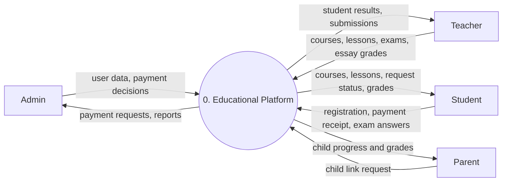
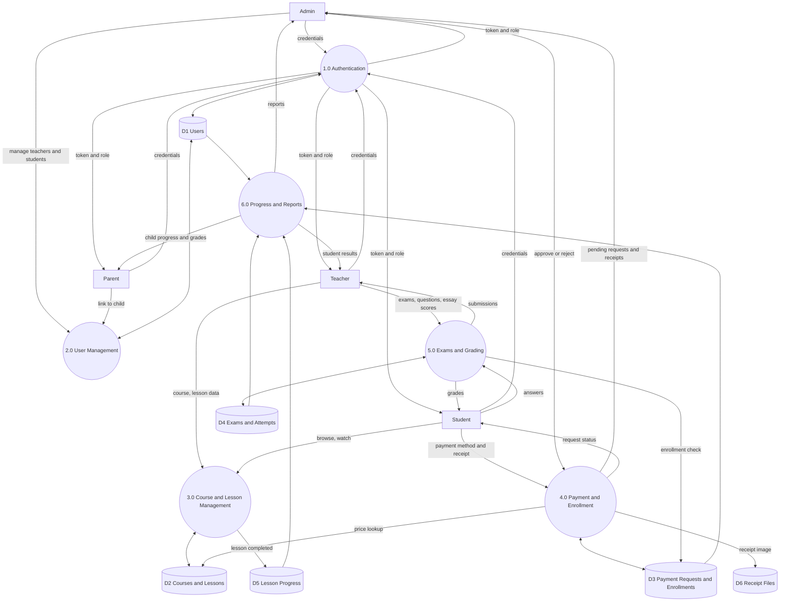

# 6. Data Flow Diagrams (DFD)

## 6.1 Context Diagram (Level 0)

```mermaid
flowchart LR
    ADM["Admin"]
    TCH["Teacher"]
    STD["Student"]
    PAR["Parent"]
    SYS(("0. Educational Platform"))

    ADM -- "user data, payment decisions" --> SYS
    SYS -- "payment requests, reports" --> ADM

    TCH -- "courses, lessons, exams, essay grades" --> SYS
    SYS -- "student results, submissions" --> TCH

    STD -- "registration, payment receipt, exam answers" --> SYS
    SYS -- "courses, lessons, request status, grades" --> STD

    PAR -- "child link request" --> SYS
    SYS -- "child progress and grades" --> PAR
```

## 6.2 Level 1 DFD

```mermaid
flowchart TB
    ADM["Admin"]
    TCH["Teacher"]
    STD["Student"]
    PAR["Parent"]

    P1(("1.0 Authentication"))
    P2(("2.0 User Management"))
    P3(("3.0 Course and Lesson Management"))
    P4(("4.0 Payment and Enrollment"))
    P5(("5.0 Exams and Grading"))
    P6(("6.0 Progress and Reports"))

    D1[("D1 Users")]
    D2[("D2 Courses and Lessons")]
    D3[("D3 Payment Requests and Enrollments")]
    D4[("D4 Exams and Attempts")]
    D5[("D5 Lesson Progress")]
    D6[("D6 Receipt Files")]

    ADM & TCH & STD & PAR -- "credentials" --> P1
    P1 <--> D1
    P1 -- "token and role" --> ADM & TCH & STD & PAR

    ADM -- "manage teachers and students" --> P2
    PAR -- "link to child" --> P2
    P2 <--> D1

    TCH -- "course, lesson data" --> P3
    STD -- "browse, watch" --> P3
    P3 <--> D2
    P3 -- "lesson completed" --> D5

    STD -- "payment method and receipt" --> P4
    P4 -- "receipt image" --> D6
    P4 <--> D3
    P4 -- "price lookup" --> D2
    ADM -- "approve or reject" --> P4
    P4 -- "pending requests and receipts" --> ADM
    P4 -- "request status" --> STD

    TCH -- "exams, questions, essay scores" --> P5
    STD -- "answers" --> P5
    P5 <--> D4
    P5 -- "enrollment check" --> D3
    P5 -- "grades" --> STD
    P5 -- "submissions" --> TCH

    D4 --> P6
    D5 --> P6
    D3 --> P6
    D1 --> P6
    P6 -- "reports" --> ADM
    P6 -- "child progress and grades" --> PAR
    P6 -- "student results" --> TCH
```
