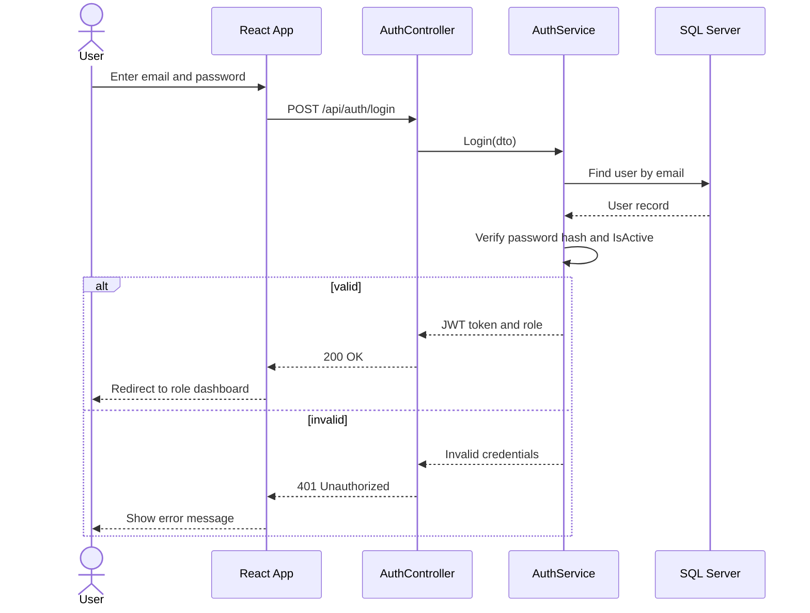
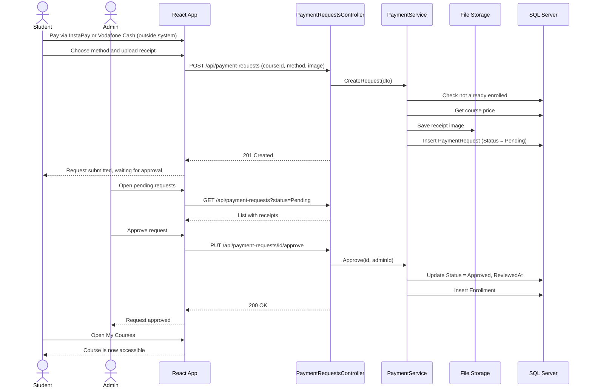
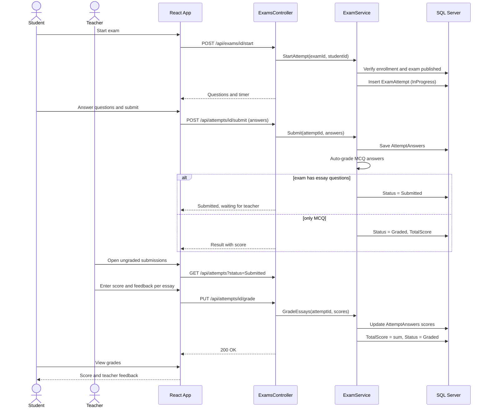

# 7. Sequence Diagrams

## 7.1 Login

```mermaid
sequenceDiagram
    actor U as User
    participant FE as React App
    participant API as AuthController
    participant SV as AuthService
    participant DB as SQL Server

    U->>FE: Enter email and password
    FE->>API: POST /api/auth/login
    API->>SV: Login(dto)
    SV->>DB: Find user by email
    DB-->>SV: User record
    SV->>SV: Verify password hash and IsActive
    alt valid
        SV-->>API: JWT token and role
        API-->>FE: 200 OK
        FE-->>U: Redirect to role dashboard
    else invalid
        SV-->>API: Invalid credentials
        API-->>FE: 401 Unauthorized
        FE-->>U: Show error message
    end
```

## 7.2 Payment Request and Enrollment Approval

```mermaid
sequenceDiagram
    actor S as Student
    actor A as Admin
    participant FE as React App
    participant API as PaymentRequestsController
    participant SV as PaymentService
    participant FS as File Storage
    participant DB as SQL Server

    S->>FE: Pay via InstaPay or Vodafone Cash (outside system)
    S->>FE: Choose method and upload receipt
    FE->>API: POST /api/payment-requests (courseId, method, image)
    API->>SV: CreateRequest(dto)
    SV->>DB: Check not already enrolled
    SV->>DB: Get course price
    SV->>FS: Save receipt image
    SV->>DB: Insert PaymentRequest (Status = Pending)
    API-->>FE: 201 Created
    FE-->>S: Request submitted, waiting for approval

    A->>FE: Open pending requests
    FE->>API: GET /api/payment-requests?status=Pending
    API-->>FE: List with receipts
    A->>FE: Approve request
    FE->>API: PUT /api/payment-requests/id/approve
    API->>SV: Approve(id, adminId)
    SV->>DB: Update Status = Approved, ReviewedAt
    SV->>DB: Insert Enrollment
    API-->>FE: 200 OK
    FE-->>A: Request approved
    S->>FE: Open My Courses
    FE-->>S: Course is now accessible
```

## 7.3 Take Exam and Grade Essay Questions

```mermaid
sequenceDiagram
    actor S as Student
    actor T as Teacher
    participant FE as React App
    participant API as ExamsController
    participant SV as ExamService
    participant DB as SQL Server

    S->>FE: Start exam
    FE->>API: POST /api/exams/id/start
    API->>SV: StartAttempt(examId, studentId)
    SV->>DB: Verify enrollment and exam published
    SV->>DB: Insert ExamAttempt (InProgress)
    API-->>FE: Questions and timer
    S->>FE: Answer questions and submit
    FE->>API: POST /api/attempts/id/submit (answers)
    API->>SV: Submit(attemptId, answers)
    SV->>DB: Save AttemptAnswers
    SV->>SV: Auto-grade MCQ answers
    alt exam has essay questions
        SV->>DB: Status = Submitted
        API-->>FE: Submitted, waiting for teacher
    else only MCQ
        SV->>DB: Status = Graded, TotalScore
        API-->>FE: Result with score
    end

    T->>FE: Open ungraded submissions
    FE->>API: GET /api/attempts?status=Submitted
    T->>FE: Enter score and feedback per essay
    FE->>API: PUT /api/attempts/id/grade
    API->>SV: GradeEssays(attemptId, scores)
    SV->>DB: Update AttemptAnswers scores
    SV->>DB: TotalScore = sum, Status = Graded
    API-->>FE: 200 OK
    S->>FE: View grades
    FE-->>S: Score and teacher feedback
```
