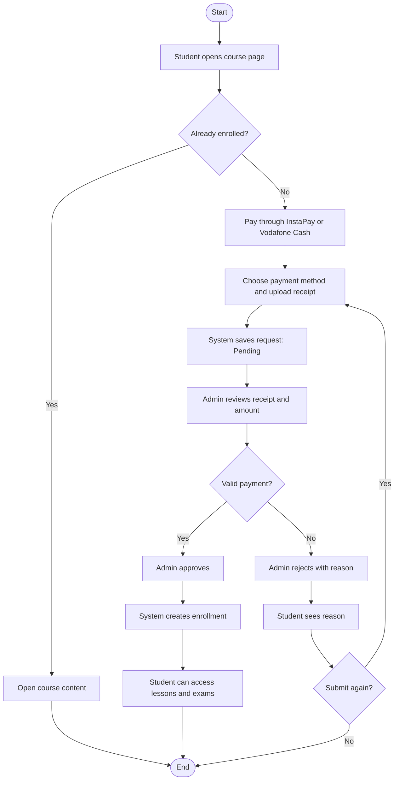
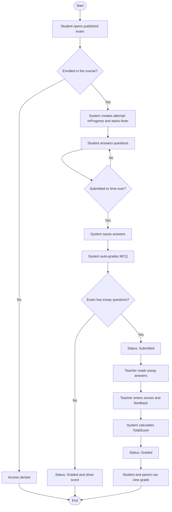
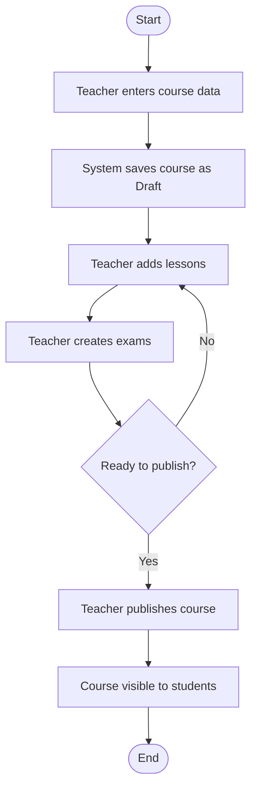

# 8. Activity Diagrams

## 8.1 Course Enrollment with Manual Payment

```mermaid
flowchart TD
    A(["Start"]) --> B["Student opens course page"]
    B --> C{"Already enrolled?"}
    C -- Yes --> D["Open course content"] --> Z(["End"])
    C -- No --> E["Pay through InstaPay or Vodafone Cash"]
    E --> F["Choose payment method and upload receipt"]
    F --> G["System saves request: Pending"]
    G --> H["Admin reviews receipt and amount"]
    H --> I{"Valid payment?"}
    I -- Yes --> J["Admin approves"]
    J --> K["System creates enrollment"]
    K --> L["Student can access lessons and exams"] --> Z
    I -- No --> M["Admin rejects with reason"]
    M --> N["Student sees reason"]
    N --> O{"Submit again?"}
    O -- Yes --> F
    O -- No --> Z
```

## 8.2 Exam Taking and Grading

```mermaid
flowchart TD
    A(["Start"]) --> B["Student opens published exam"]
    B --> C{"Enrolled in the course?"}
    C -- No --> X["Access denied"] --> Z(["End"])
    C -- Yes --> D["System creates attempt: InProgress and starts timer"]
    D --> E["Student answers questions"]
    E --> F{"Submitted or time over?"}
    F -- No --> E
    F -- Yes --> G["System saves answers"]
    G --> H["System auto-grades MCQ"]
    H --> I{"Exam has essay questions?"}
    I -- No --> J["Status: Graded and show score"] --> Z
    I -- Yes --> K["Status: Submitted"]
    K --> L["Teacher reads essay answers"]
    L --> M["Teacher enters scores and feedback"]
    M --> N["System calculates TotalScore"]
    N --> O["Status: Graded"]
    O --> P["Student and parent can view grade"] --> Z
```

## 8.3 Course Creation by Teacher

```mermaid
flowchart TD
    A(["Start"]) --> B["Teacher enters course data"]
    B --> C["System saves course as Draft"]
    C --> D["Teacher adds lessons"]
    D --> E["Teacher creates exams"]
    E --> F{"Ready to publish?"}
    F -- No --> D
    F -- Yes --> G["Teacher publishes course"]
    G --> H["Course visible to students"] --> Z(["End"])
```
