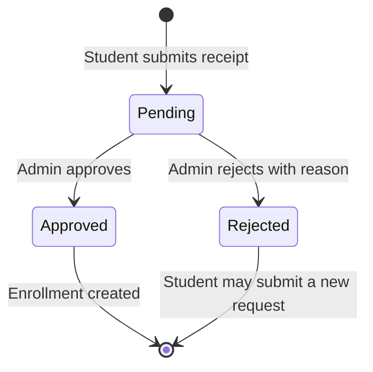
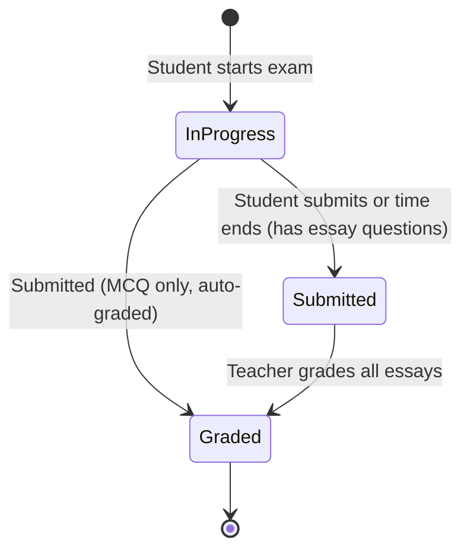
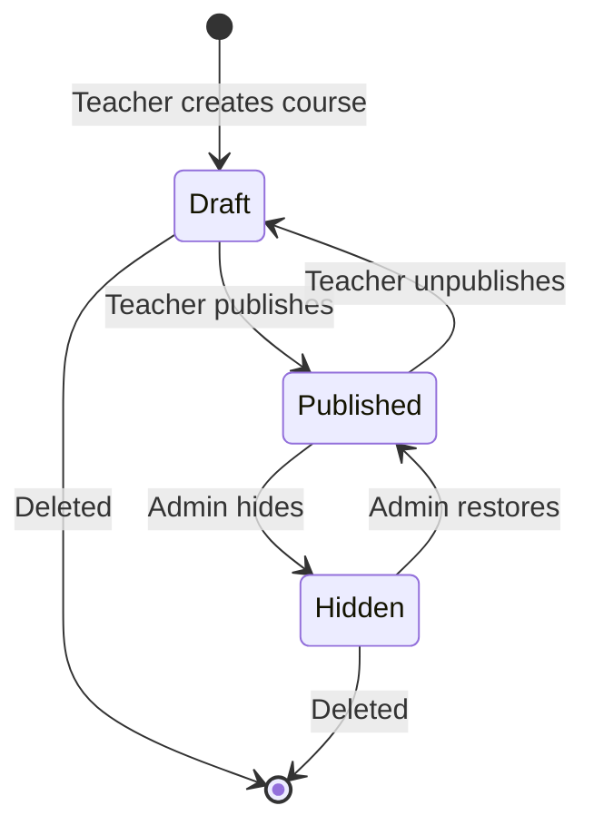

# 9. State Diagrams

## 9.1 PaymentRequest

```mermaid
stateDiagram-v2
    [*] --> Pending: Student submits receipt
    Pending --> Approved: Admin approves
    Pending --> Rejected: Admin rejects with reason
    Approved --> [*]: Enrollment created
    Rejected --> [*]: Student may submit a new request
```

## 9.2 ExamAttempt

```mermaid
stateDiagram-v2
    [*] --> InProgress: Student starts exam
    InProgress --> Submitted: Student submits or time ends (has essay questions)
    InProgress --> Graded: Submitted (MCQ only, auto-graded)
    Submitted --> Graded: Teacher grades all essays
    Graded --> [*]
```

## 9.3 Course

```mermaid
stateDiagram-v2
    [*] --> Draft: Teacher creates course
    Draft --> Published: Teacher publishes
    Published --> Draft: Teacher unpublishes
    Published --> Hidden: Admin hides
    Hidden --> Published: Admin restores
    Draft --> [*]: Deleted
    Hidden --> [*]: Deleted
```
