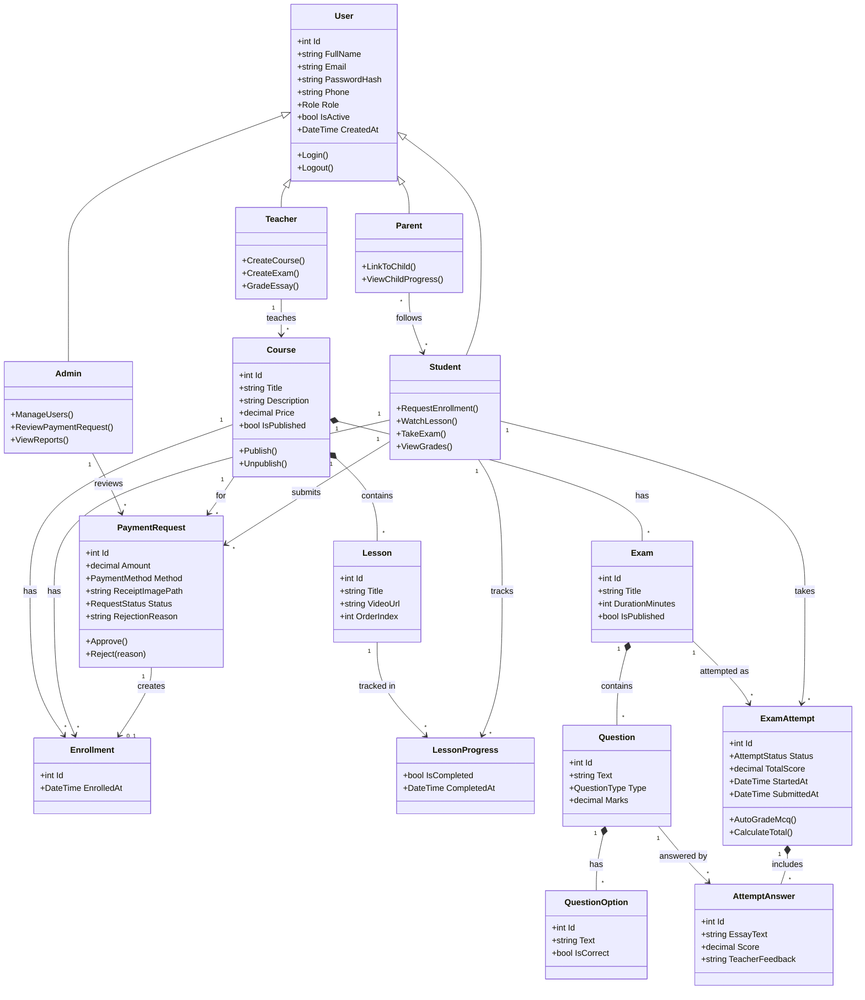

# 10. Class Diagram

```mermaid
classDiagram
    class User {
        +int Id
        +string FullName
        +string Email
        +string PasswordHash
        +string Phone
        +Role Role
        +bool IsActive
        +DateTime CreatedAt
        +Login()
        +Logout()
    }
    class Admin {
        +ManageUsers()
        +ReviewPaymentRequest()
        +ViewReports()
    }
    class Teacher {
        +CreateCourse()
        +CreateExam()
        +GradeEssay()
    }
    class Student {
        +RequestEnrollment()
        +WatchLesson()
        +TakeExam()
        +ViewGrades()
    }
    class Parent {
        +LinkToChild()
        +ViewChildProgress()
    }
    class Course {
        +int Id
        +string Title
        +string Description
        +decimal Price
        +bool IsPublished
        +Publish()
        +Unpublish()
    }
    class Lesson {
        +int Id
        +string Title
        +string VideoUrl
        +int OrderIndex
    }
    class PaymentRequest {
        +int Id
        +decimal Amount
        +PaymentMethod Method
        +string ReceiptImagePath
        +RequestStatus Status
        +string RejectionReason
        +Approve()
        +Reject(reason)
    }
    class Enrollment {
        +int Id
        +DateTime EnrolledAt
    }
    class LessonProgress {
        +bool IsCompleted
        +DateTime CompletedAt
    }
    class Exam {
        +int Id
        +string Title
        +int DurationMinutes
        +bool IsPublished
    }
    class Question {
        +int Id
        +string Text
        +QuestionType Type
        +decimal Marks
    }
    class QuestionOption {
        +int Id
        +string Text
        +bool IsCorrect
    }
    class ExamAttempt {
        +int Id
        +AttemptStatus Status
        +decimal TotalScore
        +DateTime StartedAt
        +DateTime SubmittedAt
        +AutoGradeMcq()
        +CalculateTotal()
    }
    class AttemptAnswer {
        +int Id
        +string EssayText
        +decimal Score
        +string TeacherFeedback
    }

    User <|-- Admin
    User <|-- Teacher
    User <|-- Student
    User <|-- Parent

    Teacher "1" --> "*" Course : teaches
    Course "1" *-- "*" Lesson : contains
    Course "1" *-- "*" Exam : has
    Student "1" --> "*" PaymentRequest : submits
    Course "1" --> "*" PaymentRequest : for
    Admin "1" --> "*" PaymentRequest : reviews
    PaymentRequest "1" --> "0..1" Enrollment : creates
    Student "1" --> "*" Enrollment : has
    Course "1" --> "*" Enrollment : has
    Student "1" --> "*" LessonProgress : tracks
    Lesson "1" --> "*" LessonProgress : tracked in
    Exam "1" *-- "*" Question : contains
    Question "1" *-- "*" QuestionOption : has
    Student "1" --> "*" ExamAttempt : takes
    Exam "1" --> "*" ExamAttempt : attempted as
    ExamAttempt "1" *-- "*" AttemptAnswer : includes
    Question "1" --> "*" AttemptAnswer : answered by
    Parent "*" --> "*" Student : follows
```

> In the database, the four roles are stored in one `Users` table with a `Role` column (table-per-hierarchy); in code they can be modeled as the `Role` enum or as subclasses.
